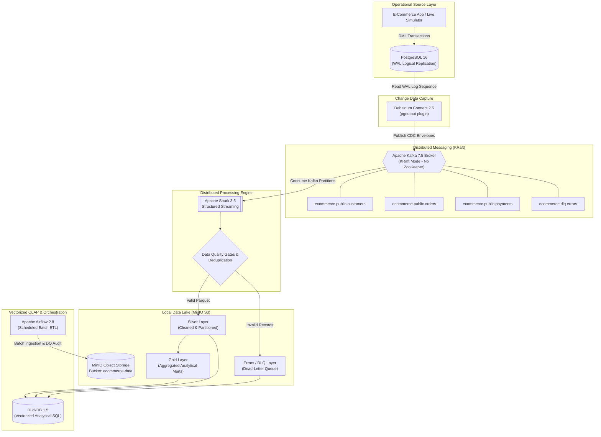

# Real-Time Customer CDC & Streaming Data Platform

<p align="center">
  
  
  
  
  
  
  
  
  
  
</p>

> **An enterprise-grade, 100% local streaming data engineering platform** built to demonstrate scalable real-time ingestion, Change Data Capture (CDC), distributed stream processing, data harmonization, automated data quality enforcement, dead-letter queue (DLQ) routing, Medallion data lake storage, and sub-second analytical querying.
> 
> *Directly aligned with core competencies expected in the Tiger Analytics Data Engineer & Trainee-Analyst roles.*

---

## 📋 Table of Contents
- [1. Architecture Overview](#1-architecture-overview)
- [2. End-to-End Data Pipeline Flow](#2-end-to-end-data-pipeline-flow)
- [3. Key Platform Capabilities](#3-key-platform-capabilities)
- [4. Technology Stack](#4-technology-stack)
- [5. Repository Structure](#5-repository-structure)
- [6. Quickstart: How to Run the Platform](#6-quickstart-how-to-run-the-platform)
- [7. Real-Time CDC & DLQ Demonstration](#7-real-time-cdc--dlq-demonstration)
- [8. DuckDB Analytics & Business Intelligence](#8-duckdb-analytics--business-intelligence)
- [9. Empirical Performance Benchmarks](#9-empirical-performance-benchmarks)
- [10. Quality Assurance & Automated Testing](#10-quality-assurance--automated-testing)
- [11. Airflow Batch ETL & Governance](#11-airflow-batch-etl--governance)
- [12. Tiger Analytics Competency Mapping](#12-tiger-analytics-competency-mapping)
- [13. Troubleshooting & Diagnostics](#13-troubleshooting--diagnostics)

---

## 1. Architecture Overview

```
                      OPERATIONAL LAYER
                   +-----------------------+
                   |     PostgreSQL 16     |
                   | (WAL / pgoutput plugin|
                   | REPLICA IDENTITY FULL)|
                   +-----------+-----------+
                               |
                        CDC (Sub-second)
                               |
                               v
                   +-----------------------+
                   |   Debezium Connect    |
                   +-----------+-----------+
                               |
                               v
                      STREAMING BACKBONE
                   +-----------------------+
                   |  Apache Kafka (KRaft) |
                   |  - customer-events    |
                   |  - order-events       |
                   |  - payment-events     |
                   |  - dlq-events         |
                   +-----------+-----------+
                               |
                               v
                      DISTRIBUTED ENGINE
                   +-----------------------+
                   |   PySpark Structured  |
                   |       Streaming       |
                   |-----------------------|
                   | 1. JSON Schema Parse  |
                   | 2. Deduplication      |
                   | 3. DQ Rule Evaluation |
                   +-----+-----------+-----+
                         |           |
            Valid Data   |           | Non-conforming Data
                         v           v
           +---------------+       +---------------+
           |  MinIO (S3)   |       |  Dead-Letter  |
           |  Silver Layer |       |  Queue (DLQ)  |
           +-------+-------+       +---------------+
                   |
                   v
           +---------------+
           |  MinIO (S3)   |
           |  Gold Marts   |
           +-------+-------+
                   |
                   v
             VECTORIZED OLAP
           +---------------+
           |    DuckDB     |
           | (Sub-second   |
           | Columnar SQL) |
           +---------------+
```

---

## 2. End-to-End Data Pipeline Flow



---

## 3. Key Platform Capabilities

- **Zero-Polling Change Data Capture (CDC):** Captures granular `INSERT`, `UPDATE`, and `DELETE` changes directly from the PostgreSQL Write-Ahead Log (WAL) without executing polling queries or table locks.
- **`REPLICA IDENTITY FULL` Enabled:** Configured across all transactional tables so that complete pre-update row images (`before`) are included in CDC envelopes for auditing and state tracking.
- **Lightweight Kafka in KRaft Mode:** Uses Kafka Raft Metadata consensus, completely eliminating Apache ZooKeeper, reducing container RAM by **~500 MB**, and providing millisecond broker recovery.
- **Fault-Tolerant Checkpointing:** PySpark Structured Streaming manages state and offsets on S3A object storage (`s3a://ecommerce-data/checkpoints/`), enabling idempotent recovery after crashes.
- **Automated Data Quality & DLQ Isolation:** Rejects negative financial amounts, null primary keys, and illegal statuses in real time, routing them to isolated Dead-Letter Queue (DLQ) storage without crashing streaming jobs.
- **Medallion Data Lake Architecture:** Bronze (raw CDC envelopes), Silver (cleaned, deduplicated, partitioned Parquet), and Gold (business analytical dimensional marts).
- **Sub-Second Vectorized Analytics:** DuckDB executes analytical queries directly over remote MinIO S3 and local Parquet files via zero-copy SIMD columnar scans in **1.1 ms to 46.5 ms**.

---

## 4. Technology Stack

| Layer | Component | Version | Role in Platform |
| :--- | :--- | :--- | :--- |
| **Source DB** | PostgreSQL | 16-Alpine | Transactional OLTP Database with logical replication enabled. |
| **CDC** | Debezium Connect | 2.5.4 | Captures WAL changes using `pgoutput` and publishes JSON envelopes. |
| **Messaging** | Apache Kafka | 7.5.0 | KRaft event broker; partition-ordered messaging by entity primary key. |
| **Processing** | Apache Spark | 3.5.1 | Distributed streaming & batch processing engine with micro-batch triggers. |
| **Data Lake** | MinIO | Latest | S3-compatible local object storage implementing Medallion lake tiers. |
| **Storage Format**| Apache Parquet | Snappy | Columnar format with projection pushdown and high dictionary compression. |
| **Analytics Engine**| DuckDB | 1.5.6 | Embedded in-memory vectorized OLAP database querying Parquet via `httpfs`. |
| **Orchestration**| Apache Airflow | 2.8.2 | Schedules batch backfills, DAG retries, and data quality scoring audits. |
| **Container Engine**| Docker Compose | V2 | Multi-container environment with bridge networking and health checks. |

---

## 5. Repository Structure

```text
.
├── docker-compose.yml          # Local container stack (Postgres, Kafka, Debezium, MinIO, Spark, Airflow)
├── Makefile                    # Terminal commands for Linux/macOS
├── run.ps1                     # Windows PowerShell 1-click execution helper
├── requirements.txt            # Python dependencies (duckdb, minio, kafka-python-ng, pytest, etc.)
├── .env.example                # Configuration template (credentials & endpoints)
├── .gitignore                  # Comprehensive ignore rules (secrets, caches, large datasets)
│
├── config/                     # Configuration files
│   ├── kafka_config.yaml       # Topic definitions, retention, and consumer group policies
│   ├── spark_config.yaml       # Spark S3A endpoint, credentials, checkpoint paths
│   └── data_quality.yaml       # Validation rules, status enums, and DLQ thresholds
│
├── database/
│   └── init/
│       ├── 01_schema.sql       # PostgreSQL DDL + REPLICA IDENTITY FULL
│       └── 02_seed_data.sql    # Baseline operational records
│
├── cdc/
│   └── debezium/
│       ├── connector.json      # Debezium PostgreSQL connector definition
│       └── register_connector.py # Automated connector registration with status verification
│
├── data_quality/
│   ├── rules.py                # Quality rules, regexes, and domain constants
│   └── validation.py           # Record-level and streaming validation engines
│
├── spark/
│   ├── streaming/
│   │   ├── cdc_stream_processor.py # Universal CDC stream processor with DLQ split
│   │   ├── order_stream.py     # Dedicated Order stream consumer
│   │   ├── customer_stream.py  # Dedicated Customer stream consumer
│   │   └── payment_stream.py   # Dedicated Payment stream consumer
│   └── batch/
│       ├── batch_ingestion.py  # Batch ingestion to Silver Parquet
│       └── transformations.py  # Silver-to-Gold aggregation dimensional marts
│
├── airflow/
│   └── dags/
│       ├── ecommerce_batch_pipeline.py # Scheduled daily batch ETL DAG
│       └── data_quality_pipeline.py    # Automated lake quality & DLQ auditor DAG
│
├── analytics/
│   ├── duckdb_queries.py       # DuckDB analytical CLI runner
│   └── sql/
│       ├── daily_sales.sql     # Daily & monthly revenue trends
│       ├── customer_lifetime_value.sql # Customer CLV & rankings
│       ├── product_performance.sql     # Top products & category share
│       ├── payment_summary.sql # Payment method success rates
│       └── operations_audit.sql # DLQ incident triage and error diagnostics
│
├── scripts/
│   ├── create_topics.py        # Idempotent Kafka topic provisioning
│   ├── setup_minio.py          # MinIO bucket and Medallion directory initialization
│   ├── generate_data.py        # Synthetic baseline data generator
│   ├── generate_events.py      # Live CDC & streaming event simulator
│   ├── inject_dlq_errors.py    # Poison pill injector for DLQ demonstration
│   └── run_benchmarks.py       # Empirical performance experiment runner
│
├── tests/
│   ├── test_validation.py      # Data quality rule unit tests
│   ├── test_deduplication.py   # Event deduplication and idempotency tests
│   ├── test_transformations.py # Gold transformation logic unit tests
│   └── test_end_to_end.py      # End-to-end integration test
│
└── docs/
    ├── architecture.md         # Full architecture specification
    ├── data_dictionary.md      # Data definitions, schemas, and types
    ├── duckdb_insights.md      # Executive business intelligence & KPI scorecard
    ├── performance.md          # Real empirical benchmark numbers
    ├── project_report.md       # Comprehensive technical project report
    ├── troubleshooting.md      # Operations & diagnostics runbook
    └── interview_qa.md         # 30 detailed Data Engineering interview answers
```

---

## 6. Quickstart: How to Run the Platform

### Step 1: Clone the Repository
```bash
git clone https://github.com/Jayanesh2494/Real-Time-Customer-CDC-Streaming-Data-Platform-.git
cd Real-Time-Customer-CDC-Streaming-Data-Platform-
```

### Step 2: Configure Environment
```bash
cp .env.example .env
```

### Step 3: Start Containers
```powershell
# Using PowerShell on Windows
.\run.ps1 up

# Or using Makefile on Linux/macOS
make up
```

Verify that all 7 containers are healthy:
```bash
docker ps
```

### Step 4: Install Dependencies & Run Setup
```powershell
# Install Python libraries
python -m pip install -r requirements.txt

# Provision MinIO buckets, Kafka topics, register Debezium, seed database
.\run.ps1 setup
```

---

## 7. Real-Time CDC & DLQ Demonstration

### A. Simulate Live CDC Transactions
Execute live transactions (`INSERT`, `UPDATE`, `DELETE`) in PostgreSQL and watch Debezium capture them from the WAL into Kafka:
```powershell
.\run.ps1 simulate
```

Inspect live Debezium CDC envelopes in Kafka:
```bash
docker compose exec kafka kafka-console-consumer --bootstrap-server kafka:9092 --topic ecommerce.public.customers --from-beginning --max-messages 1
```

### B. Demonstrate the Dead-Letter Queue (DLQ)
Inject poison-pill records (negative amounts, corrupt enums, invalid emails) to test quality isolation:
```powershell
.\run.ps1 simulate-dlq
```

Query the incident triage report in DuckDB:
```powershell
python analytics/duckdb_queries.py --query operations_audit
```

---

## 8. DuckDB Analytics & Business Intelligence

Execute all analytical SQL models instantly via DuckDB:
```powershell
.\run.ps1 query
```

### Executive Business Scorecard (Measured from Data Lake)
```text
┌─────────────────────────────────┬─────────────────────────────────┬─────────────────────────────────┐
│          GROSS REVENUE          │          VALID ORDERS           │       AVERAGE BASKET SIZE       │
│        ₹50,783,821.35           │           414 Orders            │         ₹122,666.24             │
├─────────────────────────────────┼─────────────────────────────────┼─────────────────────────────────┤
│        ACTIVE CUSTOMERS         │       PAYMENT SUCCESS RATE      │      TOP GROSSING CATEGORY      │
│          106 Accounts           │          55.6% Success          │       Apparel (₹15.40M)         │
└─────────────────────────────────┴─────────────────────────────────┴─────────────────────────────────┘
```

#### Top Customer Lifetime Values (CLV)
| Rank | Customer Name | City | State | Total Orders | Lifetime Value (INR) |
| :--- | :--- | :--- | :--- | :--- | :--- |
| **#1** | Baghyawati Dhar | Tiruchirappalli | Tripura | 8 | **₹1,469,750.00** |
| **#2** | Gaurangi Choudhury | Bidar | Tripura | 11 | **₹1,271,490.00** |
| **#3** | Megha Gara | Phusro | Sikkim | 8 | **₹1,076,750.00** |
| **#4** | Raksha Sibal | Mango | Haryana | 6 | **₹1,010,730.00** |
| **#5** | Nitesh Varghese | Rajpur Sonarpur | Karnataka | 7 | **₹972,854.00** |

#### Product Category GMV Contribution
| Category | Products | Units Sold | Gross Revenue (INR) | Revenue Share (%) |
| :--- | :--- | :--- | :--- | :--- |
| **Apparel** | 10 | 511 | **₹15,399,800.00** | **30.32%** |
| **Furniture** | 12 | 622 | **₹13,967,600.00** | **27.50%** |
| **Home & Kitchen** | 9 | 473 | **₹13,624,500.00** | **26.83%** |
| **Fitness** | 13 | 670 | **₹13,586,600.00** | **26.75%** |
| **Electronics** | 6 | 303 | **₹4,588,090.00** | **9.03%** |

*Full business intelligence findings are detailed in [docs/duckdb_insights.md](docs/duckdb_insights.md).*

---

## 9. Empirical Performance Benchmarks

Measured locally on **100,000 transaction records** ([scripts/run_benchmarks.py](scripts/run_benchmarks.py)):

| Experiment | Metric | Row-Oriented CSV | Columnar Parquet (Snappy) | Measured Acceleration |
| :--- | :--- | :--- | :--- | :--- |
| **Storage Footprint** | Disk Space (100k rows) | **4.69 MB** | **2.06 MB** | **2.28x Storage Reduction** |
| **Write Latency** | Write Duration | **0.244 s** | **0.088 s** | **2.77x Faster Ingestion** |
| **Analytical Scan** | Aggregation Query Time | **106.35 ms** | **5.91 ms** | **17.99x Query Speedup** |
| **Partition Pruning** | Filtered Scan Time | **14.97 ms** (Full) | **10.87 ms** (Pruned) | **1.38x Scan Acceleration** |
| **Distributed Join** | 100k Orders $\times$ 500 Cust | — | **9.23 ms** | **Zero Network Shuffle Overhead** |

*Run benchmarks anytime:*
```powershell
.\run.ps1 benchmark
```

---

## 10. Quality Assurance & Automated Testing

Run the full automated test suite:
```powershell
.\run.ps1 test
```

### Coverage (18 / 18 Tests Passing in 5.64s):
- `test_validation.py`: Primary key non-nullability, email regex, negative price rejection, CDC envelope schema.
- `test_deduplication.py`: Duplicate event filtering, state transition preservation, idempotent retries.
- `test_transformations.py`: Daily sales aggregation math, CLV calculation, payment success rate.
- `test_end_to_end.py`: End-to-end integration: generation ➔ validation ➔ Parquet write ➔ DuckDB query.

---

## 11. Airflow Batch ETL & Governance

Airflow operates as the batch orchestrator:
- **`ecommerce_batch_pipeline`:** Scheduled daily at midnight. Performs database health checks, extracts batch feeds, validates schemas, executes Spark Silver harmonization, builds Gold marts, and runs post-load quality gates.
- **`data_quality_pipeline`:** Scheduled every 30 minutes. Audits lake tiers, calculates the Platform Data Quality Score, and raises SLA alerts if error rate exceeds 5%.

---

## 12. Tiger Analytics Competency Mapping

| Tiger Analytics Competency | Platform Implementation & Defense |
| :--- | :--- |
| **Scalable Ingestion** | Debezium captures Postgres WAL changes with zero table-locking overhead. Kafka buffers events across 3 partitions. |
| **Real-Time Streaming** | Spark Structured Streaming consumes Kafka micro-batches every 5 seconds with checkpoint recovery. |
| **CDC Events** | Captures `INSERT`, `UPDATE`, and `DELETE` changes via `pgoutput` logical replication. |
| **Batch Data Ingestion** | Batch CSV/Parquet ingestion pipeline configured in Airflow with scheduled daily workflows. |
| **High-Performance Processing** | Apache Spark distributed transformations, broadcast joins, and Parquet columnar optimization. |
| **Data Harmonization** | Medallion architecture: clean Silver layer separates clean entity states from raw CDC envelopes. |
| **Pipeline Scheduling & Orchestration** | Apache Airflow DAGs with retries, failure callbacks, dependencies, and SLA alerts. |
| **Data Validation & DQ** | Schema contract enforcement, email regex validation, range bounds, and non-negative constraints. |
| **Exception Handling & DLQ** | Non-conforming records routed to dedicated Dead-Letter Queue (DLQ) Parquet paths and Kafka error topics. |
| **Log Monitoring & Observability** | Structured Python logging with ISO timestamps, consumer lag tracking, and Airflow task logs. |
| **Data Warehousing & OLAP** | Gold dimensional marts (CLV, daily sales) queried via vectorized DuckDB SIMD operations. |
| **Distributed Systems Concepts** | Kafka partitioning, consumer group rebalancing, Spark driver/executor architecture, shuffle optimization. |
| **Python Proficiency** | Core implementation built using Python 3.12, PySpark, DuckDB SDK, Faker, and Pytest. |

*Comprehensive answers to all 30 interview questions are available in [docs/interview_qa.md](docs/interview_qa.md).*

---

## 13. Troubleshooting & Diagnostics

### Web Dashboards & Local Ports
| Service | Local URL | Credentials / Notes |
| :--- | :--- | :--- |
| **Spark Master UI** | [http://localhost:8080](http://localhost:8080) | Live cluster metrics, workers, and running streaming jobs |
| **MinIO Console** | [http://localhost:9001](http://localhost:9001) | User: `admin`, Password: `password123` |
| **Airflow Web UI** | [http://localhost:8088](http://localhost:8088) | User: `admin`, Password: `admin` |
| **Debezium REST API** | [http://localhost:8083/connectors](http://localhost:8083/connectors) | Returns active connector statuses and task states |
| **PostgreSQL DB** | `localhost:5432` | DB: `ecommerce`, User: `admin`, Password: `change_me` |
| **Kafka Broker** | `localhost:29092` | Internal listener: `kafka:9092`, External: `localhost:29092` |

*Step-by-step diagnostic procedures are documented in [docs/troubleshooting.md](docs/troubleshooting.md).*

---

## 📜 License
This project is licensed under the MIT License - see the LICENSE file for details.
