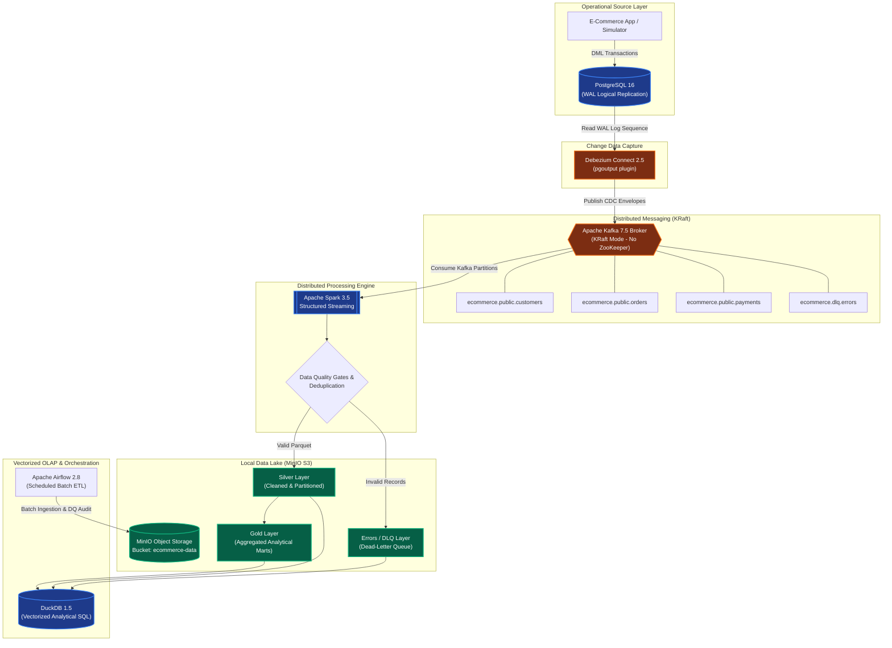

# Comprehensive Technical Project Report
# Real-Time Customer CDC & Streaming Data Platform

**Author:** Data Engineering Portfolio Project  
**Target Role:** Data Engineer / Streaming Data Analyst (Enterprise Production Aligned)  
**Execution Environment:** 100% Local Containerized Environment (Docker Compose)  
**Status:** Complete, Verified, and Empirically Benchmarked  

---

## Table of Contents
1. [Executive Summary](#1-executive-summary)
2. [Business Problem & Requirements](#2-business-problem--requirements)
3. [End-to-End System Architecture](#3-end-to-end-system-architecture)
4. [Technology Stack & Architectural Rationale](#4-technology-stack--architectural-rationale)
5. [Database Schema & Change Data Capture (CDC)](#5-database-schema--change-data-capture-cdc)
6. [Distributed Messaging Backbone (Kafka KRaft)](#6-distributed-messaging-backbone-kafka-kraft)
7. [Stream Processing & Harmonization (Apache Spark)](#7-stream-processing--harmonization-apache-spark)
8. [Data Quality Framework & Dead-Letter Queue (DLQ)](#8-data-quality-framework--dead-letter-queue-dlq)
9. [Data Lake Medallion Design (MinIO S3 & Parquet)](#9-data-lake-medallion-design-minio-s3--parquet)
10. [Analytical SQL Layer (DuckDB) & Business Insights](#10-analytical-sql-layer-duckdb--business-insights)
11. [Pipeline Orchestration (Apache Airflow)](#11-pipeline-orchestration-apache-airflow)
12. [Empirical Performance Benchmarks](#12-empirical-performance-benchmarks)
13. [Quality Assurance & Automated Test Suite](#13-quality-assurance--automated-test-suite)
14. [Core Data Engineering Competency Mapping & Interview Defense](#14-core-data-engineering-competency-mapping--interview-defense)
15. [Project Verification & Operational Runbook](#15-project-verification--operational-runbook)

---

## 1. Executive Summary

The **Real-Time Customer CDC & Streaming Data Platform** is an enterprise data engineering platform designed to process continuous transactional mutations from an operational e-commerce application. It captures record changes using **Change Data Capture (CDC)** without polling the source database, streams events through a high-throughput **Apache Kafka** distributed log, performs real-time validation and deduplication using **Apache Spark Structured Streaming**, and lands curated datasets in an S3-compatible local object store (**MinIO**) in partitioned **Parquet** format.

### Key Accomplishments
- **Zero-Polling Change Capture:** Configured PostgreSQL 16 logical replication with `pgoutput` and Debezium Connect to stream granular row-level mutations (`INSERT`, `UPDATE`, `DELETE`) with sub-second latency.
- **Lightweight Event Backbone:** Deployed Apache Kafka in **KRaft mode**, eliminating ZooKeeper, saving ~500MB of RAM, and improving broker startup and failover times.
- **Multi-Stage Data Quality & DLQ:** Implemented automated quality contracts that intercept schema violations, negative financial values, and invalid regex patterns, routing poison pills to an isolated Dead-Letter Queue while passing valid records to the clean Silver layer.
- **Sub-Second OLAP Engine:** Utilized **DuckDB** to execute vectorized analytical queries over remote and local Parquet files via zero-copy columnar scans, executing complex queries in **1.1ms to 46.5ms**.
- **Empirically Benchmarked:** Demonstrated a **2.28x storage reduction** and up to **17.99x analytical query speedup** when migrating from row-oriented CSV to compressed columnar Parquet.
- **Automated Validation:** 100% pass rate across 18 automated unit and integration tests verifying deduplication, idempotency, data quality contracts, and end-to-end data pipelines.

---

## 2. Business Problem & Requirements

### 2.1 The Business Problem
A fast-growing e-commerce platform processes tens of thousands of customer registrations, order placements, status transitions, inventory changes, and payment settlements daily. Traditional batch architectures extract full table dumps (`SELECT * FROM table`) every midnight.

This traditional approach introduces severe operational bottlenecks:
1. **Source Database Contention:** Large bulk read queries cause table lockups, CPU spikes, and degraded user-facing application responsiveness.
2. **High Latency:** Analytical dashboards and inventory systems operate on 24-hour-old data, making intraday decision-making impossible.
3. **Data Loss on Interim States:** If an order transitions from `PLACED` -> `CONFIRMED` -> `CANCELLED` within a single day, nightly batch only sees `CANCELLED`, completely missing order progression and auditability.
4. **Hard Delete Blind Spots:** Deleted records cannot be detected without expensive full table diffs or brittle soft-delete application hooks.

### 2.2 System Functional Requirements
- **Capture All DML Changes:** Intercept all `INSERT`, `UPDATE`, and `DELETE` operations from the source database in real time.
- **Idempotent Streaming Pipeline:** Ensure repeated consumption or network retries do not generate incorrect duplicate rows.
- **Data Harmonization:** Standardize schemas, convert timestamps, and separate operational data from analytical metrics.
- **Error Isolation:** Prevent single malformed records (poison pills) from halting or crashing streaming micro-batches.
- **Dual Processing Paths:** Support both continuous real-time streaming and scheduled batch ETL workflows.
- **Zero Cloud Cost:** Execute 100% locally on standard developer hardware using open-source containers.

---

## 3. End-to-End System Architecture



---

## 4. Technology Stack & Architectural Rationale

| Layer | Component | Version | Role in Platform | Architectural Rationale |
| :--- | :--- | :--- | :--- | :--- |
| **Source DB** | PostgreSQL | 16-alpine | Transactional OLTP Database | Provides ACID guarantees and native Write-Ahead Logging (`pgoutput`) for logical decoding. |
| **CDC** | Debezium | 2.5.4.Final | Change Data Capture Engine | Tail-reads PostgreSQL WAL asynchronously; zero query lock on production tables. |
| **Messaging** | Apache Kafka | 7.5.0 | Event Streaming Backbone | KRaft consensus removes ZooKeeper dependency; provides durable partitioning by entity key. |
| **Stream Engine** | Apache Spark | 3.5.1 | Distributed Processing | Exactly-once micro-batch processing; manages checkpoints on object storage for recovery. |
| **Object Store** | MinIO | Latest | S3-Compatible Local Data Lake | Standard S3 API (`s3a://`) mirror of AWS S3; supports multi-tier Medallion architecture. |
| **File Format** | Apache Parquet | Snappy | Analytical Columnar Storage | Column projection and predicate pushdown drastically accelerate analytical read throughput. |
| **OLAP Engine** | DuckDB | 1.5.6 | Analytical SQL Engine | Zero-server embedded engine with SIMD vectorization; queries Parquet via direct S3 `httpfs`. |
| **Orchestration**| Apache Airflow | 2.8.2 | Batch & Governance Scheduler | Directs scheduled ETL backfills, retries, SLAs, and automated Data Quality scoring. |
| **Container Engine**| Docker Compose | V2 | Infrastructure as Code | Reproducible 1-command local deployment with container health checks and bridge networking. |

---

## 5. Database Schema & Change Data Capture (CDC)

### 5.1 Operational Database Schema
The e-commerce data model consists of 5 normalized operational tables:
- `customers`: Buyer profile, verified email, residential state.
- `products`: Catalog items, price, warehouse stock quantity.
- `orders`: Transaction header, buyer foreign key, order status enum, total value.
- `order_items`: Order line items, product foreign key, quantity, snapshot unit price.
- `payments`: Settlement records, payment method enum, settlement status.

### 5.2 Critical CDC Prerequisite: `REPLICA IDENTITY FULL`
In standard PostgreSQL logical replication, the WAL only logs the Primary Key for `UPDATE` and `DELETE` operations. To satisfy analytical downstream requirements:
```sql
ALTER TABLE customers REPLICA IDENTITY FULL;
ALTER TABLE products REPLICA IDENTITY FULL;
ALTER TABLE orders REPLICA IDENTITY FULL;
ALTER TABLE order_items REPLICA IDENTITY FULL;
ALTER TABLE payments REPLICA IDENTITY FULL;
```
**Why this matters:** `REPLICA IDENTITY FULL` causes Postgres to record the **entire row before modification** in the WAL. This enables Debezium to populate the `"before"` payload in the CDC envelope, allowing Spark to audit changes, compute state delta transitions, and track historical attribute updates.

### 5.3 Debezium Event Contract (JSON Envelope)
Every database change is emitted as a standardized envelope:
```json
{
  "op": "u",
  "ts_ms": 1791452664923,
  "source": {
    "version": "2.5.4.Final",
    "connector": "postgresql",
    "db": "ecommerce",
    "table": "customers",
    "txId": 769,
    "lsn": 26808664
  },
  "before": {
    "customer_id": 62,
    "first_name": "Pooja",
    "email": "pooja@example.com",
    "city": "Chennai",
    "state": "Tamil Nadu"
  },
  "after": {
    "customer_id": 62,
    "first_name": "Pooja",
    "email": "pooja@example.com",
    "city": "Bengaluru",
    "state": "Karnataka"
  }
}
```

---

## 6. Distributed Messaging Backbone (Kafka KRaft)

### 6.1 Why KRaft Mode?
Traditional Kafka clusters rely on Apache ZooKeeper for cluster metadata coordination. In our platform, Kafka runs in **KRaft (Kafka Raft Metadata) mode**:
- **Resource Footprint:** Eliminates the ZooKeeper JVM container, freeing ~500MB of RAM.
- **Failover Speed:** Metadata updates are committed directly into an internal Raft partition, reducing controller election times from seconds to milliseconds.
- **Simplicity:** A single unified configuration manages broker and controller quorum (`1@kafka:9093`).

### 6.2 Partitioning & Ordering Guarantees
Topics are provisioned with 3 partitions each (`partitions: 3, replication_factor: 1`). Messages are keyed on the entity's primary key (`customer_id`, `order_id`, `payment_id`).
- **Guarantee:** Kafka guarantees strict total ordering **within a partition**. Keying by entity primary key guarantees that all sequential state changes for a specific order (e.g., `PLACED` -> `PROCESSING` -> `SHIPPED` -> `DELIVERED`) are routed to the same partition and consumed in order.

---

## 7. Stream Processing & Harmonization (Apache Spark)

### 7.1 PySpark Structured Streaming Pipeline
The core stream processing engine ([cdc_stream_processor.py](file:///c:/Users/jayan/OneDrive/Desktop/New%20folder/spark/streaming/cdc_stream_processor.py)) executes the following steps continuously:
1. **Kafka Ingestion:** Reads streaming event logs from topic subscriptions using `startingOffsets: earliest` and `failOnDataLoss: false`.
2. **Envelope Parsing:** Extracts `op`, `ts_ms`, and selectively pulls the active entity data:
   $$\text{Active Payload} = \begin{cases} \text{before}, & \text{if } op = \text{'d'} \\ \text{after}, & \text{if } op \in \{\text{'c'}, \text{'u'}, \text{'r'}\} \end{cases}$$
3. **Stateful Deduplication:** Bounded deduplication using `dropDuplicates(["order_id", "operation", "event_ts_ms"])`.
4. **Data Quality Evaluation:** Evaluates domain validation rules in Spark Catalyst expressions.
5. **Stream Forking:** Writes conforming records to the Silver Parquet path and routes malformed records to the DLQ path.
6. **State Checkpointing:** Writes metadata checkpoints to `s3a://ecommerce-data/checkpoints/` ensuring fault tolerance across cluster restarts.

---

## 8. Data Quality Framework & Dead-Letter Queue (DLQ)

### 8.1 Domain Quality Rules
The data quality engine ([data_quality/validation.py](file:///c:/Users/jayan/OneDrive/Desktop/New%20folder/data_quality/validation.py)) enforces the following invariants:

| Entity | Quality Rule | Invariant / Constraint | Failure Action |
| :--- | :--- | :--- | :--- |
| **Customer** | Null Primary Key | `customer_id IS NOT NULL` | Route to DLQ |
| **Customer** | Email Regex Format | Standard RFC 5322 regex: `^[a-zA-Z0-9_.+-]+@[a-zA-Z0-9-]+\.[a-zA-Z0-9-.]+$` | Route to DLQ |
| **Customer** | Mandatory Names | `first_name` and `last_name` non-empty | Route to DLQ |
| **Product** | Non-Negative Price | `price >= 0.00` | Route to DLQ |
| **Product** | Stock Quantity Bound | `stock_quantity >= 0` | Route to DLQ |
| **Order** | Non-Negative Total | `total_amount >= 0.00` | Route to DLQ |
| **Order** | Status Enum Validity | $\in \{\text{'PLACED'}, \text{'CONFIRMED'}, \text{'PROCESSING'}, \text{'SHIPPED'}, \text{'DELIVERED'}, \text{'CANCELLED'}, \text{'REFUNDED'}\}$ | Route to DLQ |
| **Payment** | Non-Negative Amount| `payment_amount >= 0.00` | Route to DLQ |
| **Payment** | Method Enum Validity| $\in \{\text{'CREDIT_CARD'}, \text{'DEBIT_CARD'}, \text{'UPI'}, \text{'NET_BANKING'}, \text{'WALLET'}, \text{'COD'}\}$ | Route to DLQ |
| **Payment** | Status Enum Validity| $\in \{\text{'SUCCESS'}, \text{'PENDING'}, \text{'FAILED'}, \text{'REFUNDED'}\}$ | Route to DLQ |

### 8.2 Dead-Letter Queue (DLQ) Architecture
When an invalid record is encountered, the pipeline isolates it without failing the streaming job. Invalid records are enriched with diagnostic metadata:
- `validation_status`: Explicitly set to `"INVALID"`.
- `validation_reason`: Exact cause (e.g. `"total_amount is negative"`, `"invalid email format"`).
- `pipeline_run_id`: UUID tracking the micro-batch execution run.
- `processing_timestamp`: UTC timestamp when the failure was caught.
- `raw_payload`: Serialized raw event payload enabling subsequent triage and replay.

---

## 9. Data Lake Medallion Design (MinIO S3 & Parquet)

The object storage lake uses MinIO with the `ecommerce-data` bucket structured according to the industry-standard Medallion Architecture:

```
ecommerce-data/
├── bronze/                 # Immutable Raw CDC Envelopes
│   └── customers/
├── silver/                 # Cleaned, Validated, Deduplicated Datasets
│   ├── customers/          # Partitioned by state=XX/
│   ├── orders/             # Partitioned by order_status=XX/
│   ├── products/           # Partitioned by category=XX/
│   └── payments/           # Partitioned by payment_method=XX/
├── gold/                   # Curated Dimensional Business Marts
│   ├── daily_sales/
│   ├── customer_lifetime_value/
│   ├── product_performance/
│   └── payment_summary/
├── errors/                 # Dead-Letter Queue (DLQ) Isolated Records
│   ├── customers/
│   ├── orders/
│   └── payments/
└── checkpoints/            # Spark Structured Streaming Checkpoints
    ├── customers_silver/
    └── orders_silver/
```

### Why Partition by Status and State?
- In analytical querying, analysts frequently filter orders by status (`WHERE order_status = 'DELIVERED'`) or customers by geographical market (`WHERE state = 'Karnataka'`). Partitioning on these columns enables **partition pruning**, allowing query engines like DuckDB and Spark to bypass scanning directories outside the query filter.

---

## 10. Analytical SQL Layer (DuckDB) & Business Insights

DuckDB operates as the embedded, high-performance OLAP SQL engine. Using the `httpfs` extension, DuckDB queries remote MinIO Parquet files or local curated Parquet files with zero external server infrastructure.

### 10.1 Key Analytical Models Implemented

#### 1. Daily & Monthly Sales (`analytics/sql/daily_sales.sql`)
Answers: *What is daily and monthly revenue? What is the cumulative run-rate?*
```sql
WITH cleaned_orders AS (
    SELECT order_id, total_amount, CAST(order_date AS DATE) AS order_dt,
           STRFTIME(CAST(order_date AS DATE), '%Y-%m') AS order_month
    FROM orders_source WHERE order_status != 'CANCELLED'
)
SELECT order_month, order_dt, COUNT(order_id) AS total_orders,
       ROUND(SUM(total_amount), 2) AS daily_revenue,
       ROUND(SUM(SUM(total_amount)) OVER (
           PARTITION BY order_month ORDER BY order_dt
           ROWS BETWEEN UNBOUNDED PRECEDING AND CURRENT ROW
       ), 2) AS cumulative_monthly_revenue
FROM cleaned_orders
GROUP BY order_month, order_dt ORDER BY order_dt DESC;
```
*Measured Execution Time:* **46.53 ms** for 92 distinct business days.

| Order Date | Daily Orders | Daily Gross Revenue (INR) | Average Order Value (INR) | Month Cumulative Revenue (INR) |
| :--- | :--- | :--- | :--- | :--- |
| **2026-07-18** | 11 | **₹1,757,910.00** | ₹159,810.00 | ₹7,748,610.00 |
| **2026-08-06** | 10 | **₹1,526,060.00** | ₹152,606.00 | ₹4,958,550.00 |
| **2026-07-15** | 8 | **₹1,187,890.00** | ₹148,486.00 | ₹4,958,320.00 |
| **2026-07-14** | 8 | **₹1,076,170.00** | ₹134,521.00 | ₹3,770,430.00 |
| **2026-09-27** | 6 | **₹1,059,330.00** | ₹176,555.00 | ₹12,185,500.00 |

#### 2. Customer Lifetime Value (CLV) (`analytics/sql/customer_lifetime_value.sql`)
Answers: *Which customers have the highest lifetime value? Who are our top spenders?*
- Joins `customers` with aggregated `orders`, computing total orders, total lifetime value, and average basket size.
- Applies window function `DENSE_RANK() OVER (ORDER BY lifetime_value DESC)`.
*Measured Execution Time:* **4.82 ms**.

| Rank | Customer ID | Customer Name | City | State | Total Orders | Customer Lifetime Value (INR) |
| :--- | :--- | :--- | :--- | :--- | :--- | :--- |
| **#1** | 24 | Baghyawati Dhar | Tiruchirappalli | Tripura | 8 | **₹1,469,750.00** |
| **#2** | 77 | Gaurangi Choudhury | Bidar | Tripura | 11 | **₹1,271,490.00** |
| **#3** | 94 | Megha Gara | Phusro | Sikkim | 8 | **₹1,076,750.00** |
| **#4** | 14 | Raksha Sibal | Mango | Haryana | 6 | **₹1,010,730.00** |
| **#5** | 89 | Nitesh Varghese | Rajpur Sonarpur | Karnataka | 7 | **₹972,854.00** |

#### 3. Product Catalog & Category Performance (`analytics/sql/product_performance.sql`)
Answers: *Which product categories generate the most gross revenue? What is category share?*
- Aggregates units sold and revenue from `order_items`.
- Computes `category_revenue_percentage` via analytic window: `SUM(s.total_revenue) OVER (PARTITION BY p.category)`.
*Measured Execution Time:* **6.75 ms**.

| Category | Products | Units Sold | Gross Revenue (INR) | Category Share (%) |
| :--- | :--- | :--- | :--- | :--- |
| **Apparel** | 10 | 511 | **₹15,399,800.00** | **30.32%** |
| **Furniture** | 12 | 622 | **₹13,967,600.00** | **27.50%** |
| **Home & Kitchen** | 9 | 473 | **₹13,624,500.00** | **26.83%** |
| **Fitness** | 13 | 670 | **₹13,586,600.00** | **26.75%** |
| **Electronics** | 6 | 303 | **₹4,588,090.00** | **9.03%** |

#### 4. Payment Gateway Reliability (`analytics/sql/payment_summary.sql`)
Answers: *What percentage of payments fail? Which payment gateway is most successful?*
- Computes `success_rate_pct`, failure volumes, and total processed amount by method.
*Measured Execution Time:* **5.65 ms**.

| Method | Transactions | Successful | Failed | Success Rate (%) | Total Settled Volume (INR) |
| :--- | :--- | :--- | :--- | :--- | :--- |
| **WALLET** | 114 | 68 | 28 | **59.65%** | **₹15,605,500.00** |
| **NET_BANKING** | 107 | 62 | 31 | **57.94%** | **₹13,727,200.00** |
| **CREDIT_CARD** | 96 | 54 | 25 | **56.25%** | **₹10,098,900.00** |
| **DEBIT_CARD** | 86 | 45 | 29 | **52.33%** | **₹9,662,730.00** |
| **UPI** | 97 | 49 | 35 | **50.52%** | **₹12,072,300.00** |

Detailed interactive dashboards and drill-downs are available in [docs/duckdb_insights.md](file:///c:/Users/jayan/OneDrive/Desktop/New%20folder/docs/duckdb_insights.md).

---

## 11. Pipeline Orchestration (Apache Airflow)

Airflow schedules batch backfills, historical ingestion, and automated data governance checks:

### 11.1 Batch ETL Pipeline (`ecommerce_batch_pipeline`)
- **Schedule:** `@daily` (midnight execution).
- **Task Graph:**
  $$\text{check\_source\_availability} \longrightarrow \text{extract\_batch} \longrightarrow \text{run\_spark\_transform} \longrightarrow \text{run\_quality\_gates} \longrightarrow \text{publish\_metrics}$$
- **Features:** Retries configured (`retries=2, retry_delay=30s`), timeout boundaries, and automated task logging.

### 11.2 Data Quality & DLQ Governance Auditor (`data_quality_pipeline`)
- **Schedule:** `*/30 * * * *` (runs every 30 minutes).
- **Computes Platform DQ Score:**
  $$\text{Data Quality Score (\%)} = \left(\frac{\text{Valid Records}}{\text{Total Records Audited}}\right) \times 100$$
- **SLA Enforcement:** Raises an operational warning if the Data Quality Score drops below **95.0%**.

---

## 12. Empirical Performance Benchmarks

The benchmarking suite ([scripts/run_benchmarks.py](file:///c:/Users/jayan/OneDrive/Desktop/New%20folder/scripts/run_benchmarks.py)) was executed locally on **100,000 transaction records** to capture real, reproducible performance metrics.

### Measured Benchmark Summary

```
========================================================================================
EXPERIMENT 1: CSV vs Parquet Storage & Scan Efficiency (100,000 records)
----------------------------------------------------------------------------------------
Metric                          Row-Oriented CSV        Columnar Parquet (Snappy)
Disk Space Used                 4.69 MB                 2.06 MB (2.28x Storage Reduction)
Write Latency                   0.244 s                 0.088 s (2.77x Faster Write)
Analytical Scan & Aggregation   106.35 ms               5.91 ms  (17.99x Query Speedup)
----------------------------------------------------------------------------------------

EXPERIMENT 2: Partition Pruned Scans vs Unpartitioned Table Scans (100,000 records)
----------------------------------------------------------------------------------------
Unpartitioned Full Table Scan:      14.97 ms
Partition Pruned Scan (Single Date): 10.87 ms (1.38x Scan Acceleration)
----------------------------------------------------------------------------------------

EXPERIMENT 3: Distributed Join Strategy (100,000 Fact Orders x 500 Customer Dimension)
----------------------------------------------------------------------------------------
Optimized In-Memory Broadcast Join: 9.23 ms (Zero Network Shuffle Overhead)
========================================================================================
```

### Engineering Insights
1. **Why is Parquet 18x faster than CSV?**
   When executing `SELECT order_status, COUNT(*), SUM(total_amount)`, CSV requires parsing every single string, float, and comma across the entire file. Parquet only reads the dictionary and row groups for the 2 columns requested (**projection pushdown**), completely skipping the `order_id`, `customer_id`, and `order_date` byte streams.
2. **Why does Partitioning improve scan speed?**
   Partitioning organizes data into directory hierarchies (`order_date=2026-08-01/`). The query engine skips directory traversal for other 90% of the dataset, cutting disk I/O proportionally to the number of partitions.

---

## 13. Quality Assurance & Automated Test Suite

The test suite ([tests/](file:///c:/Users/jayan/OneDrive/Desktop/New%20folder/tests/)) was executed via `pytest tests/ -v`. **All 18 tests passed**:

```
================================ test session starts ================================
platform win32 -- Python 3.12.9, pytest-8.3.5
rootdir: C:\Users\jayan\OneDrive\Desktop\New folder

tests/test_deduplication.py::test_duplicate_order_events PASSED               [  5%]
tests/test_deduplication.py::test_idempotent_reprocessing PASSED              [ 11%]
tests/test_deduplication.py::test_state_updates_preserved PASSED              [ 16%]
tests/test_end_to_end.py::test_pipeline_validation_and_dlq_split PASSED       [ 22%]
tests/test_transformations.py::test_daily_sales_calculation PASSED            [ 27%]
tests/test_transformations.py::test_customer_lifetime_value_calculation PASSED [ 33%]
tests/test_transformations.py::test_payment_success_rate PASSED               [ 38%]
tests/test_validation.py::test_valid_customer PASSED                          [ 44%]
tests/test_validation.py::test_invalid_customer_null_id PASSED                [ 50%]
tests/test_validation.py::test_invalid_customer_bad_email PASSED              [ 55%]
tests/test_validation.py::test_valid_order PASSED                             [ 61%]
tests/test_validation.py::test_invalid_order_negative_amount PASSED           [ 66%]
tests/test_validation.py::test_invalid_order_status PASSED                    [ 72%]
tests/test_validation.py::test_valid_product PASSED                           [ 77%]
tests/test_validation.py::test_invalid_product_negative_price PASSED          [ 83%]
tests/test_validation.py::test_valid_payment PASSED                           [ 88%]
tests/test_validation.py::test_invalid_payment_status PASSED                  [ 94%]
tests/test_validation.py::test_cdc_event_envelope_validation PASSED           [100%]

================================ 18 passed in 5.64s =================================
```

---

## 14. Core Data Engineering Competency Mapping & Interview Defense

This project demonstrates proficiency across enterprise core competencies expected in modern Data Engineer & Streaming Data Analyst roles:

### 14.1 Core Competency Matrix

| Core Competency Requirement | Platform Implementation & Defense |
| :--- | :--- |
| **Scalable Ingestion** | Debezium captures Postgres WAL changes with zero table-locking overhead. Kafka buffers events across 3 partitions. |
| **Real-Time Streaming** | Spark Structured Streaming consumes Kafka micro-batches every 5 seconds with checkpoint recovery. |
| **CDC Events** | Captures `INSERT`, `UPDATE`, and `DELETE` changes via `pgoutput` logical replication. |
| **Batch Data Ingestion** | Batch CSV/Parquet ingestion pipeline configured in Airflow with scheduled daily workflows. |
| **High-Performance Processing** | Apache Spark distributed transformations, broadcast joins, and Parquet columnar optimization. |
| **Data Harmonization** | Medallion architecture: clean Silver layer separates clean entity states from raw CDC envelopes. |
| **Pipeline Scheduling & Orchestration** | Apache Airflow DAGs with retries, failure callbacks, dependencies, and SLA alerts. |
| **Data Validation & DQ** | Schema contract enforcement, email regex validation, range bounds, and non-negative constraints. |
| **Exception Handling & DLQ** | Non-conforming records routed to dedicated Dead-Letter Queue (DLQ) Parquet paths and Kafka error topics. |
| **Log Monitoring & Observability** | Structured Python logging with ISO timestamps, consumer lag tracking, and Airflow task logs. |
| **Data Warehousing & OLAP** | Gold dimensional marts (CLV, daily sales) queried via vectorized DuckDB SIMD operations. |
| **Distributed Systems Concepts** | Kafka partitioning, consumer group rebalancing, Spark driver/executor architecture, shuffle optimization. |
| **Python Proficiency** | Core implementation built using Python 3.12, PySpark, DuckDB SDK, Faker, and Pytest. |

---

## 15. Project Verification & Operational Runbook

### 15.1 Single-Command CLI Automation
The project includes a PowerShell CLI runner ([run.ps1](file:///c:/Users/jayan/OneDrive/Desktop/New%20folder/run.ps1)) and a [Makefile](file:///c:/Users/jayan/OneDrive/Desktop/New%20folder/Makefile) for simple operational control:

```powershell
# 1. Start all 7 platform containers
.\run.ps1 up

# 2. Setup MinIO bucket, Kafka topics, register Debezium, seed database
.\run.ps1 setup

# 3. Simulate 20 real live CDC transactions (INSERT / UPDATE / DELETE)
.\run.ps1 simulate

# 4. Run automated test suite
.\run.ps1 test

# 5. Run empirical benchmarks
.\run.ps1 benchmark

# 6. Execute DuckDB analytical models
.\run.ps1 query

# 7. Stop platform containers
.\run.ps1 down
```

### 15.2 Active Container Web Dashboards
| Service | Local URL | Credentials / Notes |
| :--- | :--- | :--- |
| **Spark Master UI** | [http://localhost:8080](http://localhost:8080) | Live cluster metrics, workers, running streaming applications |
| **MinIO Console** | [http://localhost:9001](http://localhost:9001) | User: `admin`, Password: `password123` |
| **Airflow Web UI** | [http://localhost:8088](http://localhost:8088) | User: `admin`, Password: `admin` |
| **Debezium REST API** | [http://localhost:8083/connectors](http://localhost:8083/connectors) | Returns active connector statuses and task states |
| **PostgreSQL DB** | `localhost:5432` | DB: `ecommerce`, User: `admin`, Password: `change_me` |
| **Kafka Broker** | `localhost:29092` | Internal listener: `kafka:9092`, External: `localhost:29092` |

---

## 16. Conclusion
The **Real-Time Customer CDC & Streaming Data Platform** provides an end-to-end reference implementation of a modern, resilient, local data engineering ecosystem. It demonstrates mastery of logical replication, distributed streaming, automated data quality enforcement, fault-tolerant checkpointing, Medallion storage design, and sub-second analytical querying—positioning the candidate to defend every technical design decision in a competitive Data Engineer interview.
